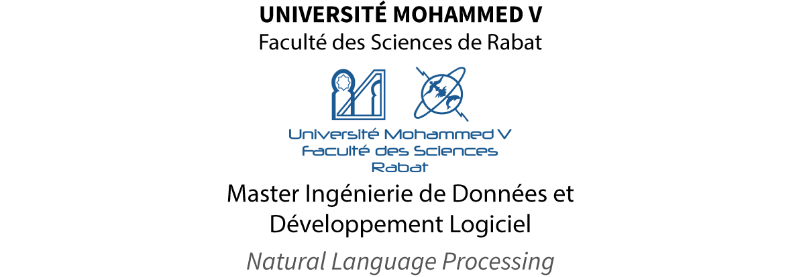
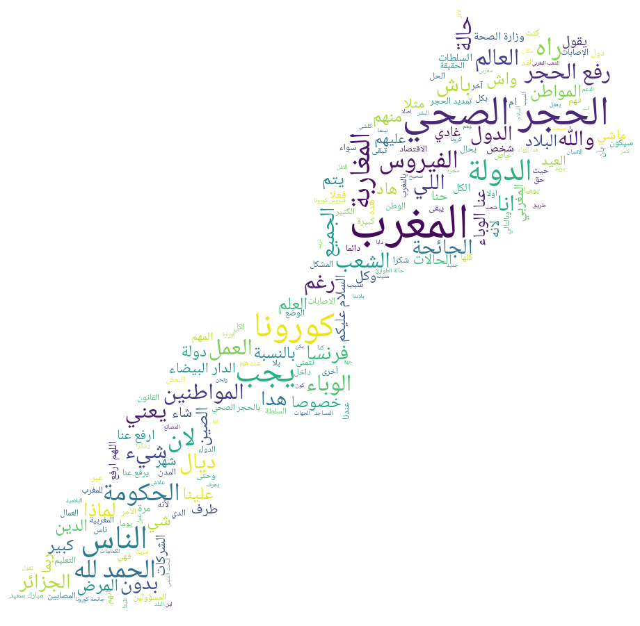

## nlp-project:

A sentiment analysis application that analyzes visitors' comments regarding <strong>covid-19 articles</strong> retrieved from the Hespress website.

  
  
Fig 1: May's comments word cloud

### Credits:
https://zerowithdot.com/colab-github-workflow/

https://github.com/mohataher/arabic-stop-words

https://gist.github.com/Humoud/f40f58cd85c5935a444c

https://link.medium.com/q2tNKPhWk8
